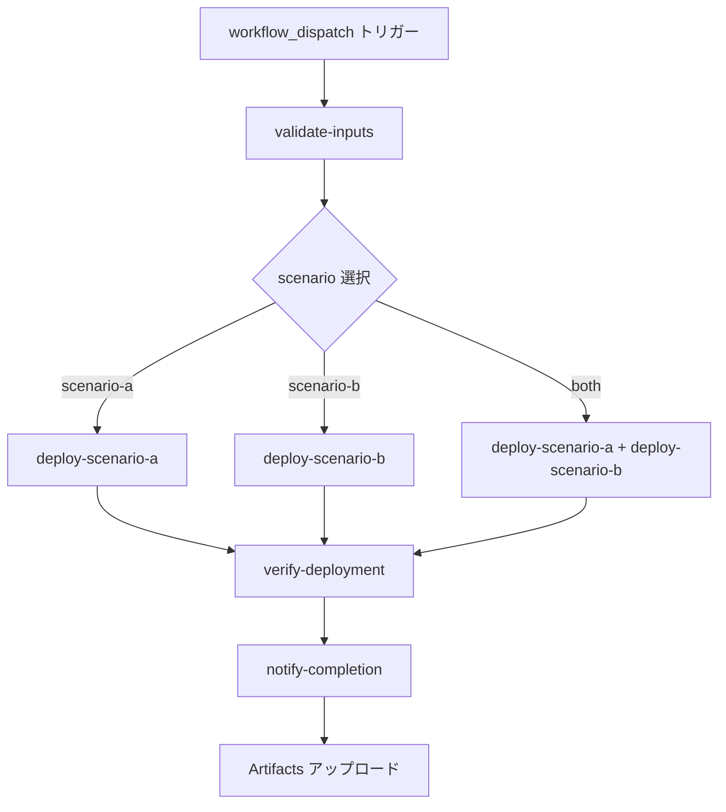
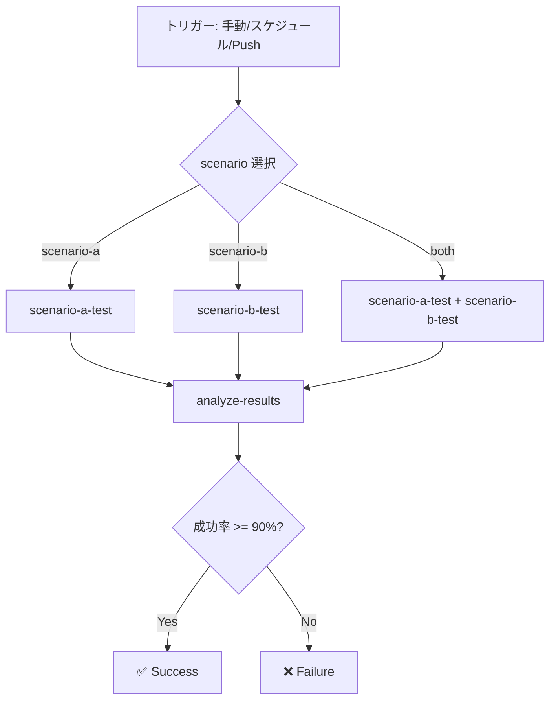

# GitHub Actions ワークフロー完備 🎉

**日付:** 2025-10-16  
**更新内容:** デプロイ用 GitHub Actions ワークフロー追加

---

## ✅ 追加されたワークフロー

### 1. Deploy Azure Infrastructure
**ファイル:** `.github/workflows/deploy-infrastructure.yml`

**機能:**
- Azure リソースの自動デプロイ
- Scenario A / Scenario B / 両方を選択可能
- リソースグループの自動作成
- 環境変数テンプレートの自動生成
- デプロイ結果の詳細サマリー

**トリガー:** 手動実行 (workflow_dispatch)

**パラメータ:**
- `scenario`: `scenario-a` / `scenario-b` / `both` (デフォルト: `both`)
- `environment`: `dev` / `prod` (デフォルト: `dev`)
- `resource_group`: リソースグループ名 (オプション、空欄で自動生成)
- `region`: `japaneast` / `eastus` / `westeurope` (デフォルト: `japaneast`)

**出力 Artifacts:**
- `scenario-a-outputs` - Scenario A のデプロイ JSON
- `scenario-b-outputs` - Scenario B のデプロイ JSON
- `deployment-env-template` - 環境変数テンプレート

**必要な GitHub Secrets:**
- `AZURE_CREDENTIALS` (サービスプリンシパル JSON)
- `AZURE_SUBSCRIPTION_ID` (サブスクリプション ID)

---

### 2. OCR Load Testing (既存・更新なし)
**ファイル:** `.github/workflows/load-test.yml`

**機能:**
- 負荷テストの自動実行
- Scenario A / Scenario B / 両方を選択可能
- カスタマイズ可能なリクエスト数とワーカー数
- 成功率 90% 閾値チェック
- 結果の JSON エクスポート

**トリガー:**
- 手動実行 (workflow_dispatch)
- スケジュール (毎日 9:00 JST)
- Push (main ブランチの scenario_*_client/**、.github/workflows/** 変更時)

---

## 📋 GitHub Actions ワークフロー比較

| 項目 | Deploy Infrastructure | OCR Load Testing |
|------|----------------------|------------------|
| **目的** | Azure リソースのデプロイ | 負荷テストの実行 |
| **トリガー** | 手動のみ | 手動 / スケジュール / Push |
| **実行頻度** | デプロイ時のみ | 毎日 + 手動 |
| **必要な Secrets** | Azure 認証 (2個) | API エンドポイント・キー (6-9個) |
| **出力** | デプロイ結果 JSON | テスト結果 JSON |
| **所要時間** | 15-20分 | 5-10分 |

---

## 🚀 使い方

### ステップ 1: Azure へのデプロイ

```bash
# GitHub で実行
Actions → "Deploy Azure Infrastructure" → "Run workflow"

# パラメータ設定
scenario: both
environment: dev
region: japaneast
```

**結果:**
- Scenario A: Computer Vision x3 リソースがデプロイされる
- Scenario B: APIM + Computer Vision x3 リソースがデプロイされる
- 環境変数テンプレートが Artifacts にアップロードされる

### ステップ 2: 環境変数の設定

1. Artifacts から `deployment-env-template` をダウンロード
2. API キーを Azure Portal から取得して記入
3. GitHub Secrets に設定:

**Scenario A:**
- `CV_PRIMARY_ENDPOINT`
- `CV_PRIMARY_KEY`
- `CV_SECONDARY_ENDPOINT`
- `CV_SECONDARY_KEY`
- `CV_TERTIARY_ENDPOINT`
- `CV_TERTIARY_KEY`

**Scenario B:**
- `APIM_GATEWAY_URL`
- `APIM_SUBSCRIPTION_KEY`
- `APIM_OCR_ENDPOINT`

### ステップ 3: 負荷テストの実行

```bash
# GitHub で実行
Actions → "OCR Load Testing" → "Run workflow"

# パラメータ設定
scenario: both
total_requests: 1000
workers: 5
```

**自動実行:**
- 毎日 9:00 JST に自動実行される
- 成功率 90% 以下の場合はワークフローが失敗として報告される

---

## 📊 ワークフローの流れ

### Deploy Infrastructure ワークフロー



### OCR Load Testing ワークフロー



---

## 🔐 セキュリティ

### 必要な GitHub Secrets

#### デプロイ用 (Deploy Infrastructure)

1. **AZURE_CREDENTIALS**
   ```bash
   az ad sp create-for-rbac \
     --name "github-actions-ocr-demo" \
     --role contributor \
     --scopes /subscriptions/{subscription-id} \
     --sdk-auth
   ```
   出力された JSON 全体を Secret に設定

2. **AZURE_SUBSCRIPTION_ID**
   - サブスクリプション ID (GUID) を設定

#### テスト用 (OCR Load Testing)

Scenario A:
- `CV_PRIMARY_ENDPOINT`, `CV_PRIMARY_KEY`
- `CV_SECONDARY_ENDPOINT`, `CV_SECONDARY_KEY`
- `CV_TERTIARY_ENDPOINT`, `CV_TERTIARY_KEY`

Scenario B:
- `APIM_GATEWAY_URL`
- `APIM_SUBSCRIPTION_KEY`
- `APIM_OCR_ENDPOINT`

---

## 📈 期待される結果

### Deploy Infrastructure (Scenario B)

```
### Scenario B Deployment Results

**APIM:**
- Gateway URL: `https://ocr-demo-apim-dev.azure-api.net`
- Subscription Key: `abcd123456***`

**Computer Vision (Primary):**
- Endpoint: `https://cv-ocr-demo-japaneast-primary.cognitiveservices.azure.com/`

**Next Steps:**
1. Upload circuit breaker policy from `infrastructure/apim/policies/advanced-circuit-breaker-policy.xml`
2. Configure Named Values in APIM for CV endpoints and keys
3. Test the deployment with load test workflow
```

### OCR Load Testing (Scenario B)

```
### Load Test Results

**Scenario B:**
- Total Requests: 1,000
- Success Rate: 100.0%
- Average Latency: 398ms
- Throughput: 12.19 req/s

✅ Success rate meets threshold (90%)
```

---

## ⚠️ 注意事項

### Scenario B の追加設定

APIM デプロイ後、以下を手動で実施:

1. **Named Values の設定** (Azure Portal)
   - APIM → Named values → Add
   - `cv-primary-endpoint`, `cv-primary-key`
   - `cv-secondary-endpoint`, `cv-secondary-key`
   - `cv-tertiary-endpoint`, `cv-tertiary-key`

2. **Circuit Breaker Policy のアップロード**
   ```bash
   cd infrastructure/apim
   ./setup-apim-api.sh
   ```

3. **API Operation の作成**
   - ワークフローで自動作成されますが、失敗した場合は手動で作成

---

## 🎯 ベストプラクティス

### CI/CD パイプライン

✅ **実装済み:**
1. インフラストラクチャのコード化 (Bicep)
2. 自動デプロイワークフロー
3. 自動負荷テストワークフロー
4. スケジュール実行 (毎日監視)
5. 成功率閾値チェック (90%)
6. デプロイ結果の可視化 (Artifacts + Summary)

✅ **セキュリティ:**
1. GitHub Secrets で認証情報を管理
2. サービスプリンシパルによる最小権限アクセス
3. 環境変数の適切な分離

---

## 📝 更新内容まとめ

| ファイル | 変更内容 |
|---------|---------|
| `.github/workflows/deploy-infrastructure.yml` | **新規作成** - 450行の包括的デプロイワークフロー |
| `README.md` | GitHub Actions セクションを大幅拡充 (デプロイとテストの両方を記載) |
| `docs/PUBLIC_RELEASE_CHECKLIST.md` | GitHub Actions ワークフロー一覧を追加 |

---

## ✅ 完了状態

**本プロジェクトは完全な CI/CD パイプラインを装備し、公開準備が完了しています!**

### 提供される機能

1. ✅ **自動デプロイ** - Azure リソースを GitHub Actions でデプロイ
2. ✅ **自動テスト** - 毎日自動で負荷テストを実行
3. ✅ **環境管理** - dev / prod 環境を分離
4. ✅ **結果可視化** - Summary タブと Artifacts で結果を確認
5. ✅ **品質保証** - 成功率 90% 閾値チェック
6. ✅ **セキュリティ** - GitHub Secrets で認証情報を安全に管理

### GitHub Actions の利点

| 項目 | 説明 |
|------|------|
| **完全自動化** | インフラデプロイから負荷テストまで自動化 |
| **再現性** | 同じ手順で何度でもデプロイ可能 |
| **チーム協業** | 全員が同じワークフローを使用 |
| **監視** | 毎日自動テストで品質監視 |
| **履歴管理** | すべてのデプロイとテスト結果が記録 |
| **セキュリティ** | 認証情報を安全に管理 |

---

**作成日:** 2025-10-16  
**バージョン:** 3.0 (GitHub Actions 完全対応版)
